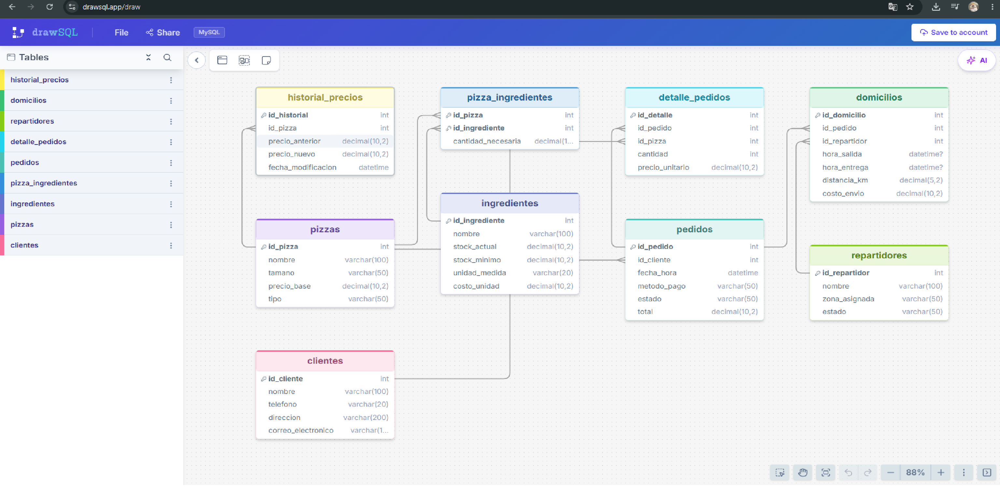
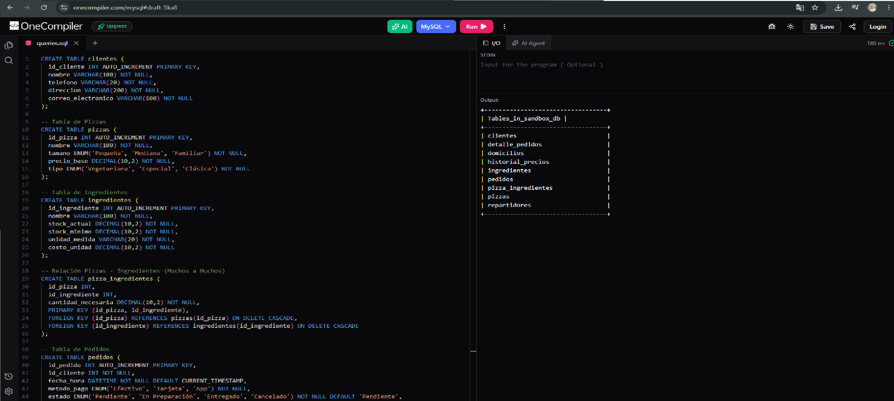
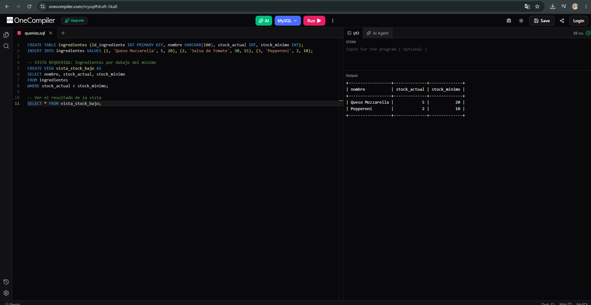
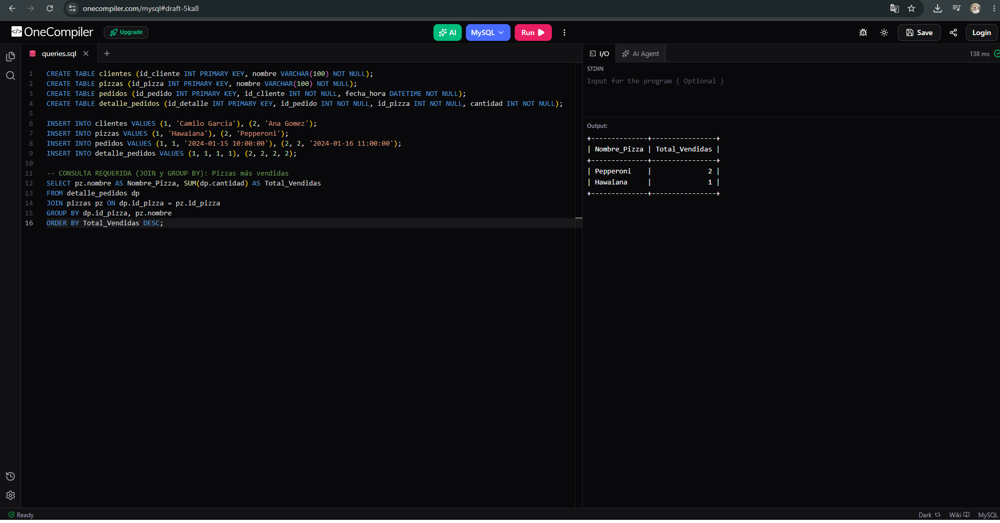

# Sistema de Gestión de Pedidos - Pizzería Don Piccolo

La empresa Pizzería Don Piccolo deseaba implementar un sistema de gestión de pedidos y domicilios para mejorar el control de sus operaciones, ya que lo manejaban de forma manual generando retrasos y errores. 

Este proyecto contiene el diseño e implementación de una base de datos relacional en MySQL que permite gestionar clientes, pizzas, ingredientes, pedidos, repartidores, domicilios y pagos. Además, se han optimizado las operaciones del negocio mediante el uso de funciones, triggers y vistas.

## Estructura del Proyecto

- `database.sql`: Contiene el script de creación de la base de datos, todas las tablas y sus relaciones (llaves primarias y foráneas).
- `funciones.sql`: Incluye funciones matemáticas y procedimientos almacenados para calcular totales y cambiar estados.
- `triggers.sql`: Scripts con los triggers de auditoría de precios, actualización de stock de ingredientes y actualización del estado de los repartidores.
- `vistas.sql`: Vistas para visualizar resúmenes rápidos (desempeño de repartidores, compras de clientes, stock de inventario).
- `consultas.sql`: Un conjunto de consultas complejas (JOIN, agrupaciones, subconsultas, etc.) que resuelven requerimientos específicos del negocio.

## Diagrama Entidad-Relación (Draw.sql)

A continuación, se presenta la estructura relacional de la base de datos de Pizzería Don Piccolo diseñada en Draw.sql:

*(Nota: Los signos de interrogación `?` en el diagrama de Draw.sql simplemente indican que el campo es "Opcional/Permite nulos" por defecto en la herramienta visual, pero en la implementación real de MySQL se han definido correctamente las restricciones `NOT NULL` en los campos obligatorios).*

## Tablas y Relaciones

El sistema se compone de 9 tablas principales:

1. **clientes**: Registra información del cliente (nombre, teléfono, dirección, correo).
2. **pizzas**: Catálogo de pizzas con nombre, tamaño, precio y tipo.
3. **ingredientes**: Control de inventario de cada ingrediente, incluyendo stock mínimo y costo.
4. **pizza_ingredientes**: Tabla pivote (Relación M:N) que vincula las pizzas con los ingredientes necesarios y la cantidad requerida para su preparación.
5. **pedidos**: Cabecera del pedido que asocia un cliente, un método de pago, el estado y el total calculado.
6. **detalle_pedidos**: Detalla qué pizzas y cuántas se solicitaron en cada pedido.
7. **repartidores**: Gestiona el equipo de domiciliarios, su zona y su disponibilidad.
8. **domicilios**: Relaciona un pedido (ya preparado) con un repartidor, registrando tiempos y costos de entrega.
9. **historial_precios**: Tabla de auditoría que guarda un registro histórico cada vez que el precio de una pizza es modificado.

### Implementación en MySQL

Aquí podemos observar la correcta creación de las tablas y sus relaciones en MySQL:

## Funciones, Procedimientos y Triggers

### 1. Triggers (Automatización de procesos)
- **`trg_actualizar_stock`**: Al insertar una pizza en el pedido (`detalle_pedidos`), este trigger busca los ingredientes necesarios en `pizza_ingredientes` y los descuenta automáticamente del `stock_actual` en la tabla `ingredientes`.
- **`trg_auditoria_precios`**: Monitorea la tabla `pizzas`. Si detecta un `UPDATE` en el `precio_base`, guarda el precio anterior, el nuevo y la fecha en `historial_precios`.
- **`trg_repartidor_disponible`**: Cuando a un domicilio se le asigna una `hora_entrega` (es decir, fue completado), automáticamente cambia el estado del repartidor a 'Disponible'.

### 2. Funciones y Procedimientos (Cálculos)
- **`calcular_total_pedido(id)`**: Suma el costo de las pizzas del pedido, añade el costo del envío y calcula el IVA (19%) retornando el total a pagar.
- **`calcular_ganancia_neta_diaria(fecha)`**: Resta los costos de los ingredientes (de las pizzas vendidas y entregadas ese día) a los ingresos totales de esos pedidos, arrojando la ganancia neta.
- **`registrar_entrega_domicilio(id_domicilio, hora)`**: Procedimiento que, al recibir la confirmación de entrega de un domiciliario, actualiza la hora en el registro y cambia automáticamente el estado del pedido a 'Entregado'.

## Vistas y Consultas SQL

### Vistas para Reportes Rápidos
Las vistas creadas (`vista_resumen_clientes`, `vista_desempeno_repartidores`, `vista_stock_bajo`) permiten a la pizzería obtener reportes vitales en tiempo real sin tener que reescribir queries largos. 

Ejemplo de vista de resumen en ejecución:

### Consultas SQL Complejas (Requerimientos)
El archivo `consultas.sql` resuelve preguntas de negocio como:
- ¿Qué clientes pidieron entre X e Y fecha? (BETWEEN)
- ¿Cuáles son las pizzas más vendidas? (GROUP BY y COUNT)
- ¿Cuál es el promedio de tiempo de entrega por cada zona? (AVG y JOIN)
- ¿Quiénes son los clientes que han gastado más de $50,000 históricamente? (HAVING)
- ¿Quiénes son nuestros clientes frecuentes (más de 5 pedidos en el mes actual)? (Subconsulta)

---

## Instrucciones de Ejecución

Para implementar y probar esta base de datos en tu gestor MySQL (por ejemplo, phpMyAdmin, MySQL Workbench o DBeaver), sigue estos pasos en orden:

1. Ejecuta el archivo `database.sql` para crear la base de datos, las tablas y las relaciones.
2. (Opcional) Inserta datos de prueba en las tablas respetando el orden de las llaves foráneas (primero clientes, pizzas, ingredientes, repartidores. Luego pizza_ingredientes, pedidos, etc).
3. Ejecuta el archivo `funciones.sql` para compilar las funciones y el procedimiento.
4. Ejecuta el archivo `triggers.sql` para activar las reglas de negocio automáticas.
5. Ejecuta el archivo `vistas.sql`.
6. Finalmente, abre `consultas.sql` y ejecuta cualquiera de los scripts para probar la extracción de datos.
